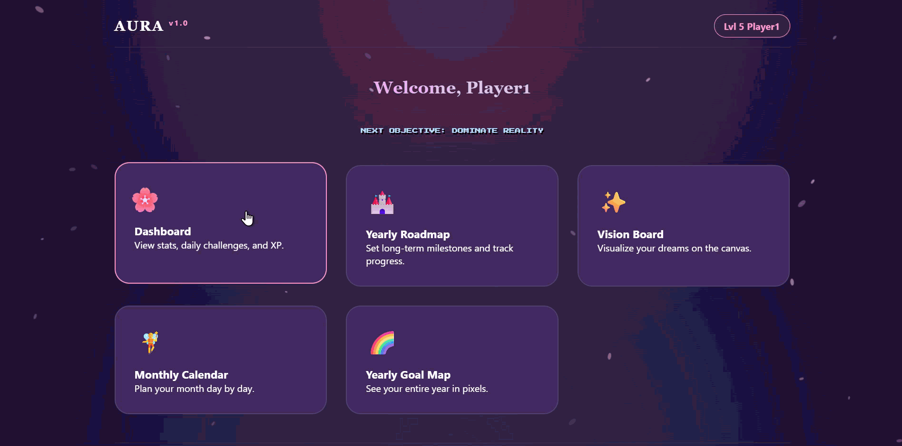

# Aura Vision Board Website 🐾✨


> a playful yet functional space to visualize goals, track progress, and gamify personal growth.

**Live Demo:** [https://hxnx444.github.io/Aura-vision-board-website/](https://hxnx444.github.io/Aura-vision-board-website/)

---

## 💡 overview

aura is an interactive vision board website for organizing personal goals, planning milestones, and visualizing long-term objectives.  
built with **HTML, CSS & vanilla JavaScript**, it showcases **clean ui design, dynamic interactivity, and modular code structure**.  

hosted on **GitHub Pages**, Aura is fully static, lightweight, and instantly accessible.

---

## 🌸 features

- **dashboard overview:** quick glance at goals, progress, and daily tasks  
- **vision board canvas:** add, edit, and organize goals visually  
- **monthly planner:** plan tasks month by month  
- **yearly goal map:** track long-term objectives  
- **interactive ui:** smooth transitions, hover effects, playful neon-inspired aesthetics  
- **lightweight & fast:** fully static with minimal dependencies  

---

## 🛠 tech stack

`html5` | `css3` | `javascript (vanilla)` | `git` | `github pages`

> emphasis on modular JavaScript, semantic markup, and responsive design.

---

## 🗂 project structure

Aura-vision-board-website/
├─ index.html # main page
├─ styles/
│ └─ style.css # layout, styling, visual effects
├─ scripts/
│ └─ main.js # interactive functionality
├─ assets/
│ └─ images/ # icons, backgrounds, screenshots
└─ README.md # project documentation

---

## 🚀 how to run locally

1. Clone the repo:
```bash
git clone https://github.com/hxnx444/Aura-vision-board-website.git
```
2. Open index.html in your preferred browser

fully static — no backend setup required

---

## 🧠 challenges & learnings

Implemented dynamic DOM manipulation for interactive goal cards

structured modular JavaScript for readability & maintainability

designed an intuitive, visually appealing ui balancing functionality with aesthetics

deployed live using GitHub Pages

strengthened frontend skills, ui/ux design, and problem-solving

---
## 🔮 future improvements

Add user authentication to save personalized boards

improve mobile responsiveness & touch interactions

Implement smooth animations for transitions and feedback

Add data persistence via local storage or backend

---
## 🎯 conclusion

aura blends playful aesthetics with functional frontend development, demonstrating my ability to build interactive, user-focused applications.
Perfect for portfolio & GitHub profile, showcasing both technical skills and creative problem-solving.

Thanks for visiting! 💫
Explore the live demo and see what I’ve built so far.

---


